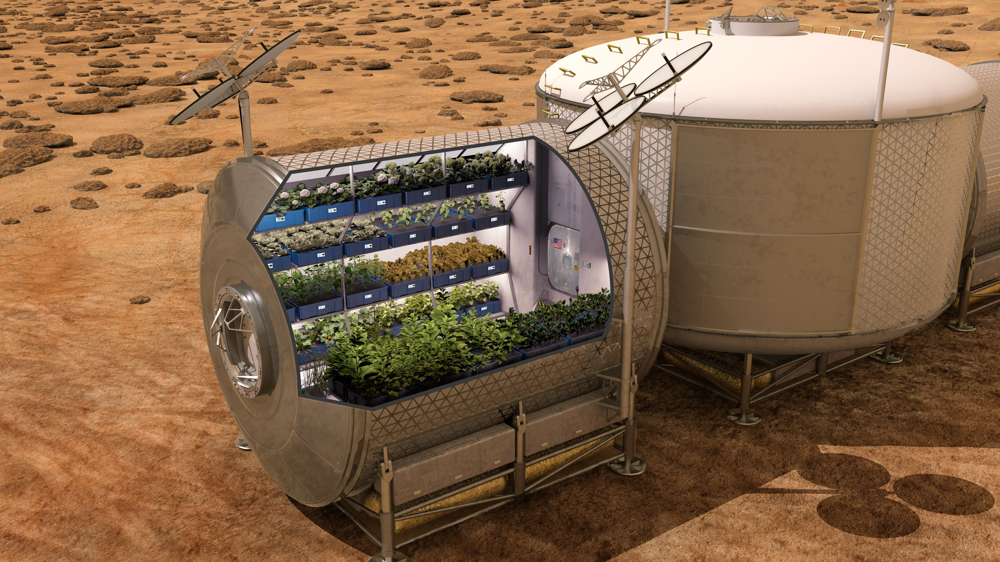

```{r setup, include=FALSE}
knitr::opts_chunk$set(echo = FALSE)
```

  
## Informations about the article
**Source of the article:** Science Daily: [link](https://www.sciencedaily.com/releases/2020/10/201027105405.htm)
  
Icarus (research paper): [link](https://www.sciencedirect.com/science/article/pii/S0019103520304061?via%3Dihub)
  
**Word count:** 636
  
## Vocabulary

| Word from the text | Synonym/definition in English    | French translation  |
|--------------------|----------------------------------|---------------------|
| To haul            | To transport                     | Transporter         |
| The soil           | The substrate / The regolith     | Le substrat, le sol |
| To mimic           | To imitate                       | Imiter              |
| A hurdle           | An obstacle                      | Un obstacle         |
| Sustainable        | Durable                          | Durable             |
| The prospect       | The likelihood / The feasibility | La probabilité      |
| To hinge           | To depend on                     | Dépendre de         |
| Potting            | = Planting a plant in a pot      | Mettre en pot       |

## Analysis table about the study

| Researchers?         | University of Georgia: - Laura Fackrell - Paul Schroeder - Mussie Habteselassie - Aaron Thompson                                                                                                                                                                                                                                                                                                                                                                                                                                                                                                                                 |
|----------------------|----------------------------------------------------------------------------------------------------------------------------------------------------------------------------------------------------------------------------------------------------------------------------------------------------------------------------------------------------------------------------------------------------------------------------------------------------------------------------------------------------------------------------------------------------------------------------------------------------------------------------------|
| Published in? When?  | Science Daily (and others like Journal Icarus), The 27th of October 2020                                                                                                                                                                                                                                                                                                                                                                                                                                                                                                                                                         |
| General topic        | Soil simulations to better understand how to grow plants on Mars                                                                                                                                                                                                                                                                                                                                                                                                                                                                                                                                                                 |
| Study                | A group of (astro-)geologists from the University of Georgia has developed artificial soil mixtures that mimic materials found on Mars to better test out farming techniques that will be utilized on future manned mission to the red planet. Despite having a deeply hostile environment, Mars's soil has shown some essential properties, both in its components and texture, that  makes it suitable for hosting an eventual plant in a near future. Researchers are confident they can utilize their findings in more "down-to-earth" projects that reach from agriculture innovations to better productivity of our crops. |
| Conclusion           | The challenges are still enormous but the research in Space Farming is in  its infancy. Nonetheless, these studies are critical. As Fackrell said: "The question of whether we can use Mars soil to provide that food will go a long way towards determining the feasibility of manned missions."                                                                                                                                                                                                                                                                                                                                |
| Unanswered question? | Too many to list, this is breakthrough research!                                                                                                                                                                                                                                                                                                                                                                                                                                                                                                                                                                                 |


