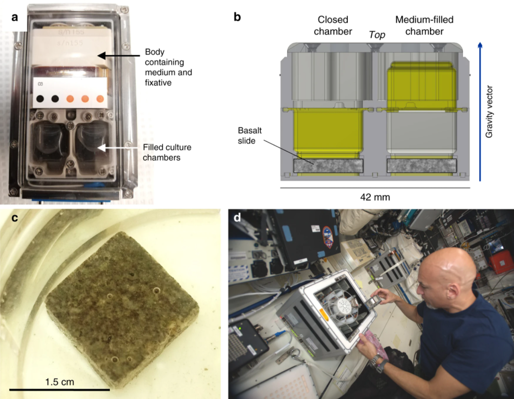

  
```{r setup, include=FALSE}
knitr::opts_chunk$set(echo = FALSE)
```
  
# Microbes To Demonstrate Biomining Of Asteroid Material Aboard The Space Station
  
As explained many times on this blog before, one of the ke elements to human expansion on other planets is finding the resources needed in order to thrive in an extra-terrestrial context! Since carrying payload is overly expensive, we can't expect Amazon or UberEats deliveries in space (although we might see that happen [sooner than we think](https://www.theverge.com/2017/3/2/14797704/jeff-bezos-blue-origin-amazon-lunar-shipping-cargo-delivery-moon)). A way we found to produce de necessary goods to survive with little materials is.. well mining it on the planet! But rare metals aren't just laying on the ground for the astronauts to pick up.. Or are they? In the analysis, I will cover a breakthrough experiment in the field of spaceborne Biomining: BioRock (followed by Edinburgh’s BioAsteroid mission).
  

  
## Informations about the article
**Source of the article:** [Biorock](https://www.esa.int/Science_Exploration/Human_and_Robotic_Exploration/Building_an_extra-terrestrial_habitat_one_microbe_at_a_time)
  
**Word count:** 594
  
## Vocabulary
  
| Word from the text | Synonym/definition in English      | French translation           |
|--------------------|------------------------------------|------------------------------|
| An alloy           | A compound made of multiple metals | Un alliage                   |
| To be embedded in  | To be nested/ingrained/inserted    | Être incrusté dans           |
| A bacterial strain | A certain breed of the bacteria    | Une souche bactérienne       |
| To thrive          | To develop/prosper                 | Prospérer/survivre           |
| To yield           | To produce/output                  | Produire                     |
  
## Analysis table about the study
  
| Researchers?         | Nicol Caplin                                                                                                                                                                                                                                                                                                                                                                                                                                                                                                                                                                                                                                                                                                                                                                                                                                                                                                         |
|----------------------|----------------------------------------------------------------------------------------------------------------------------------------------------------------------------------------------------------------------------------------------------------------------------------------------------------------------------------------------------------------------------------------------------------------------------------------------------------------------------------------------------------------------------------------------------------------------------------------------------------------------------------------------------------------------------------------------------------------------------------------------------------------------------------------------------------------------------------------------------------------------------------------------------------------------|
| Published in? When?  | ESA website 12 Nov. 2020 then follow up 4th Dec. 2020                                                                                                                                                                                                                                                                                                                                                                                                                                                                                                                                                                                                                                                                                                                                                                                                                                                                |
| General topic        | Using specific bacterial strains to mine precious compounds from rocks such as basalt.                                                                                                                                                                                                                                                                                                                                                                                                                                                                                                                                                                                                                                                                                                                                                                                                                               |
| Study                | As we're getting closer and closer to going back to the moon ([Artemis 2024](https://www.nasa.gov/specials/artemis/)), we are in dire need of finding solutions to make inter-planetary shipments as scarce as possible. Sending payload in space is indeed very expensive, so scientists found a solution to extract precious compounds without heavy mining equipment: Bacteria! The biomining technique has been used for years on earth to digest poisonous substances contained in areas difficult to reach. The idea is simple: use bacteria strains to "digest" rocks and extract their precious contents to avoid carrying heavy material and stocks! Those materials will then be used to build faster and more efficient equipment on the surface of the colonized planet. The experiment in microgravity showed that the 3 strains thrived and 2 processed as much compounds as they would have on Earth! |
| Conclusion           | This novel method of Biomining will revolutionize space travel, as it will become less and less expensive to mine rare compounds on other planets, thus decreasing the overall cost of human expansion in the solar system, and beyond!                                                                                                                                                                                                                                                                                                                                                                                                                                                                                                                                                                                                                                                                              |
| Further developments | Why did 1 of the strain have defective productivity? Can we modify those strains genetically in order to increase yielding rates? Can we use this technique on asteroids? Some of these questions will be answered in the follow up research BioAsteroid.                                                                                                                                                                                                                                                                                                                                                                                                                                                                                                                                                                                                                                                            |
  
# To go further
  
* **Follow-up Mission:** [BioAsteroid](https://www.esa.int/Science_Exploration/Human_and_Robotic_Exploration/COVID-19_drug_research_and_bio-mining_launching_to_the_International_Space_Station)
  
* **Publication from NASA:** [link](https://www.nasa.gov/feature/astronauts-harvest-first-radish-crop-on-international-space-station)
  
* **Publication in Nature:** [link](https://www.nature.com/articles/s41467-020-19276-w)
