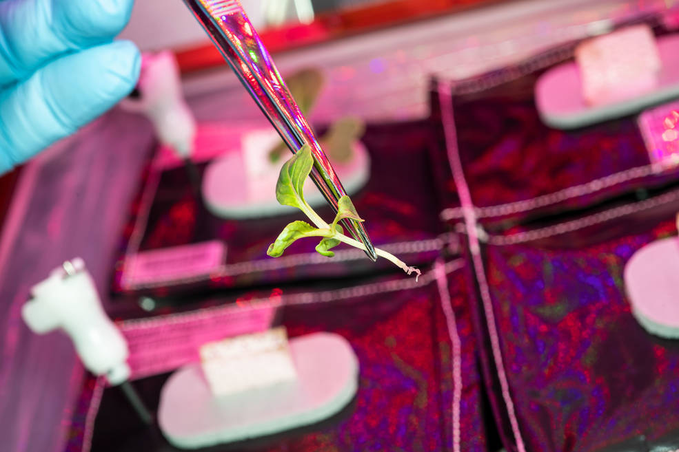

```{r setup, include=FALSE}
knitr::opts_chunk$set(echo = FALSE)
```

# Microgravity Works Wonders With Plant Transplants
  

  
## Informations about the article
**Source of the article:** [NASA](https://www.nasa.gov/feature/microgravity-works-wonders-with-plant-transplants)
  
**Word count:** 815
  
## Analysis table about the study
  
| Researchers          | Biological and Physical Sciences Division at NASA, Mike Hopkins, Gioia Massa, Matt Romeyn                                                                                                                                                                                                                                                                                                                                                                                                                                                                                                                                                                                                  |
|----------------------|--------------------------------------------------------------------------------------------------------------------------------------------------------------------------------------------------------------------------------------------------------------------------------------------------------------------------------------------------------------------------------------------------------------------------------------------------------------------------------------------------------------------------------------------------------------------------------------------------------------------------------------------------------------------------------------------|
| Published in? When?  | NASA Website  1 February 2021                                                                                                                                                                                                                                                                                                                                                                                                                                                                                                                                                                                                                                                              |
| Study                | Due to a failure in growth in two growth pouches of the VEGGIE system, NASA astronaut Mike Hopkins successfully transplanted 2 sprouts from other pouches in an attempt to save the yield of the deficient pouches. It would appear that plant transplants methods impossible on earth, such as the removal of a tiny sprout from its culture medium, can be accomplished in space thanks to microgravity and its influence on the sprout's inner fluids. Such an experiment had never been conducted before, because the risks of losing precious data samples and organisms were too high. But thanks to a small mishap, great achievements in extraterrestrial plant growth were made.  |
| Conclusion           | Plants transplant are possible and viable in space, which opens doors to a multitude of procedures to increase the flexibility, the resiliency and the durability of space farming. The sustainability of humans in space can now be increased, and crops can be "duplicated"!                                                                                                                                                                                                                                                                                                                                                                                                             |
| Further developments | Upgrade of space alimentation, self-sustainability, crops duplication, upgrade of astronaut diet and mood. The next experiment in the VEGGIE unit will focus on the rest of the VEG-03I                                                                                                                                                                                                                                                                                                                                                                                                                                                                                                    |
  
# To go further
  
* **Nasa Veg-03 program sheet:** [link](https://www.nasa.gov/mission_pages/station/research/experiments/explorer/Investigation.html?#id=1159)

