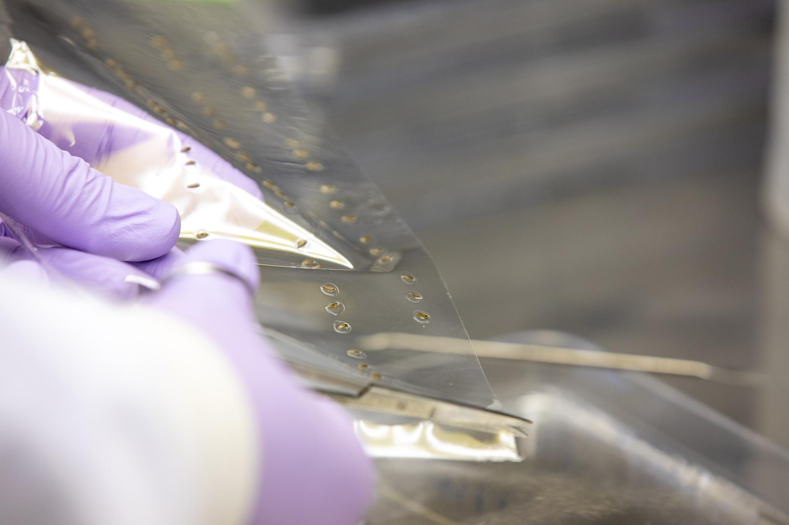

```{r setup, include=FALSE}
knitr::opts_chunk$set(echo = FALSE)
```

# Seed Film Brings New Way to Grow Plants in Space
  
As previously explained in this blog, the VEGGIE system allows plants to be grown in space with minimal regulation from the crew. However, the pillows - or pouches - the seeds were planted into were pre-inseminated with a seed back on earth. To cut the middleman, NASA adapted the already well-known seed-placement technology for microgravity use, so that seeds could be planted directly in space.


  
## Informations about the article
**Source of the article:** [NASA](https://www.nasa.gov/feature/seed-film-brings-new-way-to-grow-plants-in-space)
  
**Word count:** 782
  
## Vocabulary
  
| Word from the text       | Synonym/definition in English       | French translation           |
|--------------------------|-------------------------------------|------------------------------|
| A wick                   | Strip of porous material            | Une mèche                    |
| A patent                 | A license for intellectual property | Un brevet                    |
| To span back to          | To relate back to                   | Remonter à (dans le temps)   |
| To imbed/embed           | To fix an object firmly             | Encastrer                    |
| To retain                | To absorb and continue to hold      | Conserver, retenir           |
| Aseptic                  | Free from bacteria/sterilized       | Aseptique, stérilisé         |
  
## Analysis table about the study
  
| Researchers          | NASA's Kennedy Space Center Research Department: Matt Romeyn, Aaron Curry, Trent Smith, Niki Padgett and Mike Hopkins                                                                                                                                                                                                                                                                                                                                                                                                                                                                                                                                                        |
|----------------------|------------------------------------------------------------------------------------------------------------------------------------------------------------------------------------------------------------------------------------------------------------------------------------------------------------------------------------------------------------------------------------------------------------------------------------------------------------------------------------------------------------------------------------------------------------------------------------------------------------------------------------------------------------------------------|
| Published in? When?  | NASA Website, 26 February 2021                                                                                                                                                                                                                                                                                                                                                                                                                                                                                                                                                                                                                                               |
| Study                | A novel method to grow plants in space has been successfully tested aboard the ISS on Feb. 2, 2021! The experiment involved PLANTING a seed into the VEGGIE plant pillows, instead of using a "pre-seeded" pillow from Earth. The technique consisted in pre-encapsulating the seeds into a water-soluble polymer film in order to protect it from bacterial infection and other hazards until it was planted aboard the ISS. Results were staggering, as the establishment of the newly grown lettuce was 1-2 days ahead of previous VEGGIE experiments aboard the station! The yield was also superior, and the lettuce seemed to have grown in a more homogeneous manner. |
| Conclusion           | Plants can now be PLANTED in space, and the yield is better than it has ever been aboard the space station!                                                                                                                                                                                                                                                                                                                                                                                                                                                                                                                                                                  |
| Further developments | They intend to refine the film's composition to allow it to be "easy to handle yet stiff enough to easily insert into the Veggie pillows in microgravity. It also must dissolve away to allow the seeds to germinate while also withstanding the sanitizing and aseptic processing used to minimize possible microbial growth after planting." NASA and CSA are currently sourcing potential solutions outside the agency and aerospace sector with the Deep Space Food Challenge.                                                                                                                                                                                           |
  
# To go further
  
* **Nasa Veg-03 program sheet:** [link](https://www.nasa.gov/mission_pages/station/research/experiments/explorer/Investigation.html?#id=1159)

