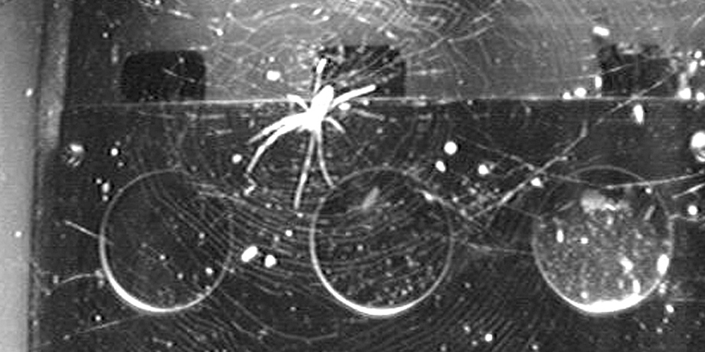

```{r setup, include=FALSE}
knitr::opts_chunk$set(echo = FALSE)
```

# Spiders in space: without gravity, light becomes key to orientation
  
As previously stated, gravity is essential for many organisms. So what would happen if we were to remove hat component? As humans, we've already explored the idea and its effect on our body (see mitochondria article). But how about web-building spiders? The 26th of May 2011, a specimen of the spider species Trichonephila clavipes was seen building a web on board of ISS. Normally, spiders sense up and down in order to orientate their webs effectively to catch preys. But how did it pull hat off in microgravity? A paper has been released on the 3rd of December 2020, explaining its mechanism.
  

  
## Informations about the article
**Source of the article:** [University of Basel](https://www.unibas.ch/en/News-Events/News/Uni-Research/Spiders-in-space--without-gravity--light-becomes-key-to-orientation-.html)
  
**Citation:** Zschokke, S., Countryman, S. & Cushing, P.E. Spiders in space—orb-web-related behaviour in zero gravity. Sci Nat 108, 1 (2021). https://doi.org/10.1007/s00114-020-01708-8
  
**Word count:** 918
  
## Vocabulary
  
| Word from the text       | Synonym/definition in English                                | French translation           |
|--------------------------|--------------------------------------------------------------|------------------------------|
| Muddled                  | Not arranged in order; untidy.                               | Embrouillé, brouillon        |
| To nag at                | Harrass someone about something                              | Harceler                     |
| To crop up again         | To reoccur/ To happen again                                  | Refaire surface              |
| Markedly                 | To an noticeable extent; significantly                       | Nettement                    |
| a stroke of luck         | Fortunate occurrence that could not have been predicted      | Un coup de chance            |
  
## Analysis table about the study
  
| Researchers          | NASA's Kennedy Space Center Research Department, along with Samuel Zschokke, Stefanie Countryman and Paula E. Cushing                                                                                                                                                                                                                                                                                                                                                                                                                                                                                                                                                                                                                                                               |
|----------------------|-------------------------------------------------------------------------------------------------------------------------------------------------------------------------------------------------------------------------------------------------------------------------------------------------------------------------------------------------------------------------------------------------------------------------------------------------------------------------------------------------------------------------------------------------------------------------------------------------------------------------------------------------------------------------------------------------------------------------------------------------------------------------------------|
| Published in? When?  | The Science of Nature 03 December 2020                                                                                                                                                                                                                                                                                                                                                                                                                                                                                                                                                                                                                                                                                                                                              |
| Study                | Recent research shows that in absence of gravity, web-building spiders resort to an auxiliary unexpected back-up system analog to phototropism. When building their webs, spiders normally rely on gravity to sense up and down, which helps them orientate the web perpendicularly to the ground. In space, up and down are mere illusions, but it doesn't seem to hinder the spider's web-building capacities. It would appear that webs built in space and in the dark are overall more symmetrical, despite being aced randomly. However, when exposed to a light source, the webs are similarly asymmetrical as the terrestrial webs. Also, the spider's resting position was normal in lamplight (ie facing towards the center of the web), but rather arbitrary in the dark. |
| Conclusion           | We now know that spiders use light as a secondary web-building sensor, even on earth!                                                                                                                                                                                                                                                                                                                                                                                                                                                                                                                                                                                                                                                                                               |
| Further developments | What other fantastic adaptive properties of earth creatures can we discover in microgravity? What bio-mimicking technologies can be developed with this conclusion?                                                                                                                                                                                                                                                                                                                                                                                                                                                                                                                                                                                                                 |
  
# To go further
  
* **Original paper:** [The Science of Nature, Volume 108, issue 1, February 2021, article 1](https://link.springer.com/article/10.1007%2Fs00114-020-01708-8)
* **PDF version:** [link](https://rdcu.be/cgsni)

