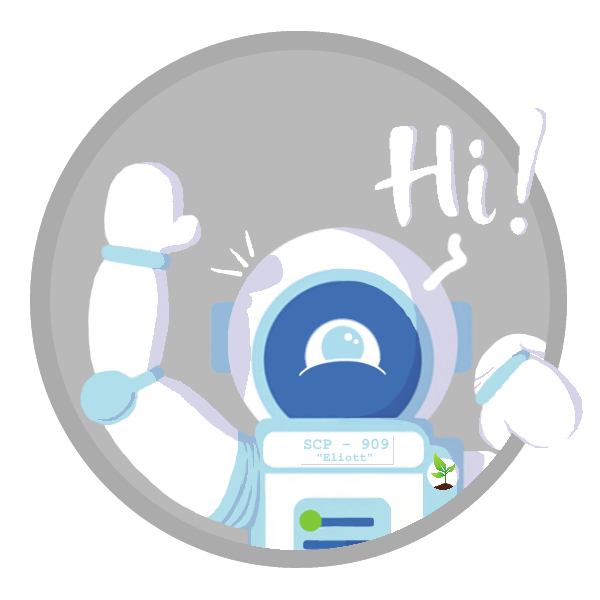

Greetings dear reader, my name is Guillaume Gégo, and this is my blog :3

You're probably have a lot of questions about what I'm doing here, and honestly, I have no idea. But still, since we're both here, tag along my journey to become one of the world's finest Astronaut's! 

After graduating from high school, I decided to carve my own path by going on a journey to find the thing that would give meaning to my life. I went on a one year exchange in Smith Falls, ON, Canada. It allowed me to become fluent in English (and completely forget my knowledge of Dutch :/).

My hobbies are as numerous as the stars of the sky, which made any life-related decision very tedious. I play piano, violin, flute, guitar, ukulele and all kind of other instruments. Music helps me cope with daily stress and helps me channel  my emotion flow. I used to program in C#, C++, Python, Swift and R, and I am fluent in French, English, and Dutch. I'm really into Shakespeare's works and I enjoy learning languages as well.

In order to achieve my dream of becoming an astronaut however, I need scholarships and bursaries to come and study in Canada for my master. That’s where the inspiration for my Science Fair project came: it was my dream and my passion. I believe that my project has a lot of potential, and I would like to continue working on it on the side as I have been doing for the past year and a half. 

The only advice I could give to anyone reading this would be: “Don’t wait for the apple to fall off the tree to get started on something you like”.

I'm currently studying biology at the University of Mons in Belgium, and I graduated from Bac 1 last year. Right now, I'm really passionate about a project called "Project MELiSSA", but I'll tell you more about that in future updates of this blog! I'd like to finish my master in biology at UGuelph in Toronto to work with a previous mentor of mine..

So that's about it for now! I'll update this page once in a while if anything changes.

See you around and have fun with this blog!

- Gégo Guillaume, DEVILLEZ, English Class, 2020-2021

[GoFundMe Page](https://www.gofundme.com/f/Help-me-grow-plants-on-Mars-by-funding-my-studies)
